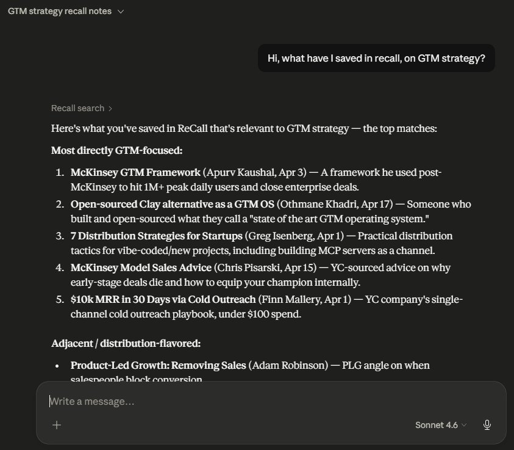

# recall-mcp

Query your [ReCall](https://recall-iota-six.vercel.app/) saved-URL corpus from inside Claude Desktop using natural language.



---

## Tools

- **`recall_search(query)`** — Semantic search over your saved URLs. Returns ranked matches with title, tag, date, similarity score, and excerpt.
- **`recall_ask(question)`** — RAG Q&A over your corpus. Ask a free-form question; get a Gemini-synthesised answer with inline citations and source links.
- **`recall_list_saved()`** — Library overview grouped by tag, with AI-generated summaries and sub-topic clusters per category.

## Install

### Option 1: One-click (recommended)

**Requirements:** [uv](https://docs.astral.sh/uv/getting-started/installation/) installed, Claude Desktop.

1. Download [`recall-mcp.mcpb`](https://github.com/Ayush-s-dsouza/recall-mcp/releases/latest) from the latest release.
2. Double-click the file (or drag it into **Claude Desktop → Settings → Extensions**) to install.
3. When prompted for **"ReCall refresh token"**, paste your token — get it from **ReCall → Settings → Connect to other apps**.
4. Restart Claude Desktop. ReCall will appear under **+ → Connectors**.

### Option 2: Manual install (for developers)

**Requirements:** Python 3.13+, [uv](https://docs.astral.sh/uv/getting-started/installation/), Claude Desktop.

```bash
git clone https://github.com/Ayush-s-dsouza/recall-mcp
cd recall-mcp
uv run mcp install server.py --name "ReCall" -v "RECALL_REFRESH_TOKEN=your_token"
```

Restart Claude Desktop. ReCall will appear under **+ → Connectors**.

> **Windows Store Claude Desktop:** `mcp install` can't find the app automatically. Edit the config file directly instead:
> `%LOCALAPPDATA%\Packages\Claude_pzs8sxrjxfjjc\LocalCache\Roaming\Claude\claude_desktop_config.json`
> and add the entry shown in [Manual config](#manual-config) below.

## Configure

| Variable | Required | Default |
|---|---|---|
| `RECALL_REFRESH_TOKEN` | Yes (preferred) | — |
| `RECALL_TOKEN` | Fallback | — |
| `RECALL_BASE_URL` | No | `https://recall-production-9941.up.railway.app` |

**Use `RECALL_REFRESH_TOKEN` — it never needs updating.** The server exchanges it for a fresh access token automatically whenever the hourly JWT expires.

Get it from **ReCall → Settings → Connect to other apps**.

`RECALL_TOKEN` (the short-lived JWT) still works as a fallback if you don't set a refresh token, but you'll need to update it every hour.

## Manual config

Add this to `claude_desktop_config.json` (path varies by OS and install method):

```json
{
  "mcpServers": {
    "ReCall": {
      "command": "uv",
      "args": ["run", "--directory", "/path/to/recall-mcp", "server.py"],
      "env": {
        "RECALL_REFRESH_TOKEN": "your_refresh_token_here"
      }
    }
  }
}
```

On Windows with a Store install, use the full path to `uv.exe` (e.g. `C:\Users\you\.local\bin\uv.exe`) and double-backslash all paths.

## Why

I built ReCall to save URLs I want to think about later. The problem: I couldn't query it from Claude Desktop while actually working. Most public MCP servers are tutorials — this one runs in my Desktop daily, against my real corpus. The gap it fills is small and specific, which is why it works.

For generic file-reading or web-fetch MCP servers, see the [official MCP server examples](https://github.com/modelcontextprotocol/servers). This one is specifically a thin layer over ReCall.

## License

MIT
